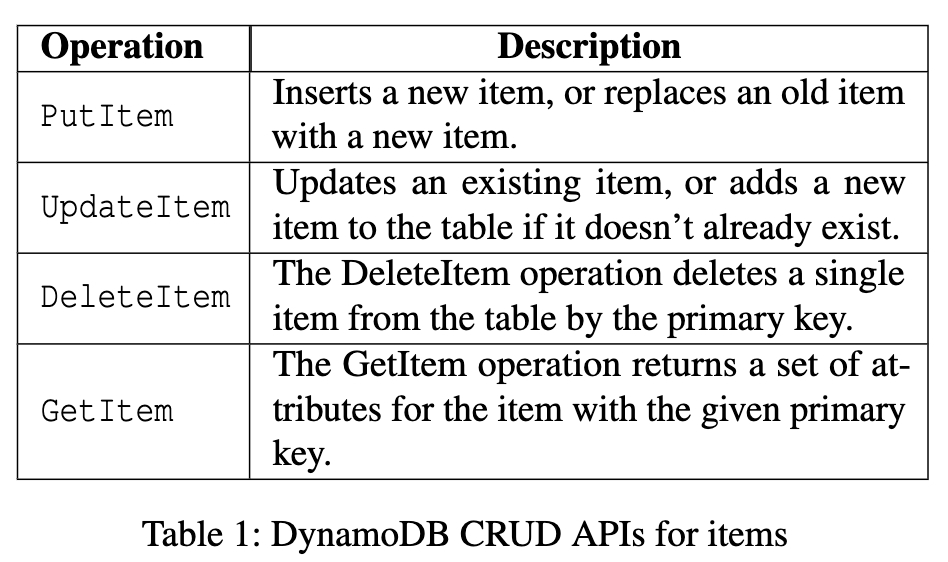
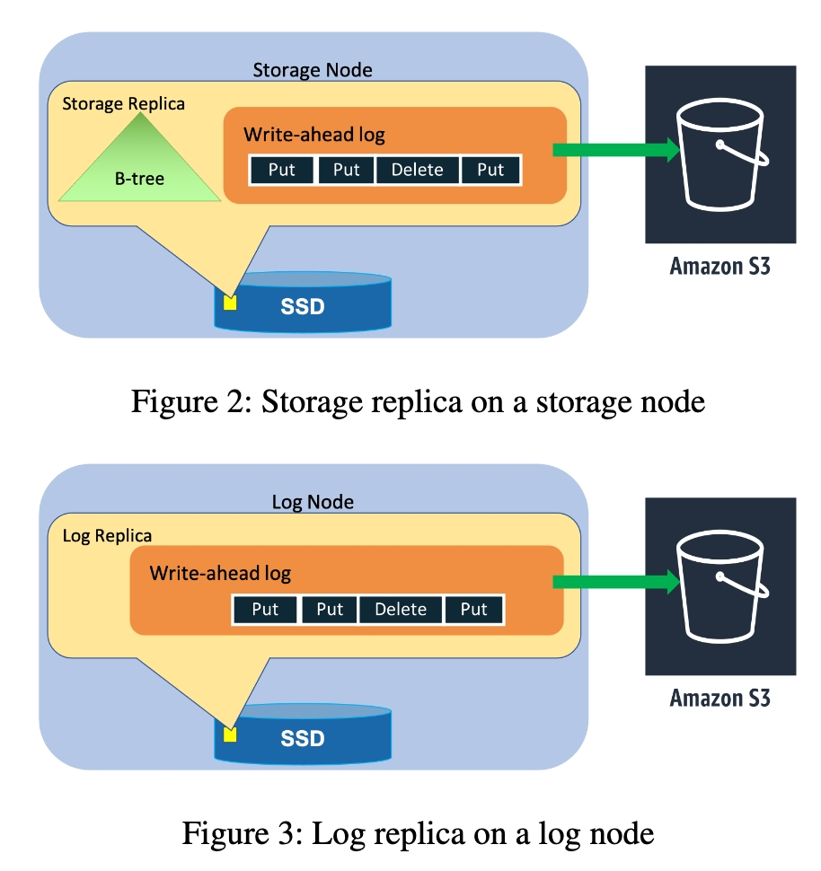
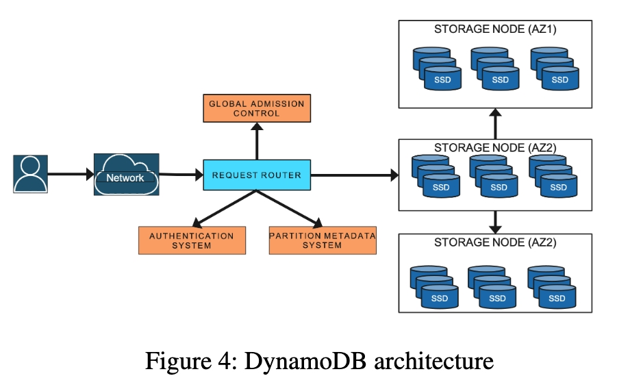

# 1. Introduction

`DynamoDB`(`/ˈdaɪ.nəmoʊ/`)在`AWS`内服务海量数据和业务，面对这些挑战，继承了六大基础特性：

- 完全托管的云服务：用户不需要关心资源，容错，升级，加密，备份恢复等。

- 多租户架构：物理机上多租户，降低成本，资源隔离用户不感知。

- 无限水平扩展：用户的表按需伸缩。

- 可预测的性能：`TP99`的延迟比`AVG`延迟更有意义，糟糕的TP99在应用层会被放大。

- 高可用：`global table`提供跨`region`的`replication`。

- 灵活使用：包含`key-value`，`document`数据模型，提供`strong consistency`和`eventual consistency`。

 

`DynamoDB`多年习得的教训：

- 适应用户的流量去做`table`的物理`partition`，可以改善用户体验。

- 对`data-at-rest`数据做持续的校验，以应对硬件故障和软件`bug`。

- 充分的`chaos`，`load`，升降级，部署安全等测试，可以让项目自由地去实验新代码特性。

- 系统的可预测性提高可以促进稳定性的提高，比如`cache`可以提高性能，一旦`cache`失效，不要让系统变得不可预测。

 

# 2. History

`DynamoDB`的前身是`Dynamo`，`Dynamo`具有`scalable`, `predictably performant`，但用户使用时需要自己运维管理。`Dynamo`之后`Amazon`出现了`SimpleDB`，`Amazon`第一个`DBAAS(database as a service)`。但是`SimpleDB`的`scalable`差，最大单表只支持`10GB`，并且由于对每个`attribute`都建索引(最近比较火的`rockset`也是这种模式)，所以`predictably performant`不好。

最后`Amazon`在`Dynamo`的`scalable`, `predictably performant`基础上吸收了`SimpleDB`的`table`模型，事务能力，云上托管能力，得到了`DynamoDB`这一集大成者。

 

# 3. Architecture

`DynamoDB`的一个`table`包含若干`items`，每个`item`是一堆`attributes`的集合。

每个`item`被`primary key`唯一标识。

每个`primary key`包含`parititon key`和`sort key`，`sort key`是可选的。`Parititon key`用来求`hash`，然后和`sort key`共同决定`item`所属的`partition`。如果两个`item`的`parititon key`一样，那么`sort key`就必须不一样。

`Primary key`的`schema`是在建表时指定的，`item`其余`attributes`的`schema`则是不固定的。

`Parititon key`和`sort key`共同决定`partition`，可能是先一级`hash`分区，然后二级`range`分区。

`DynamoDB`提供给`attributes`建立二级索引的能力。

`DynamoDB`提供的接口很简单，增删改查，这些接口都可以带一个`condition`，比如`pk`或者`secondary index`。

 

一个`DynamoDB`的`table`包含若干`partition`，每个`partition`的副本属于一个`paxos group`，通过`multi-paxos`选举`leader`副本提供`write`和强一致`read`，其余副本提供`eventually consistent read`。每个`leader`副本定期延长自己的`lease`，`follower`副本长时间联系不到`leader`副本也会发起选举，成为`leader`副本。但是旧`leader`的`lease`过期前，新leader不能提供`write`和强一致`read`。

每个副本本地是`b-tree + WAL log`的组合，`paxos`同步的也是`WAL log`。

提供`log replicas`的模式，本地只存放`WAL log`，提高`availability`和`durability`。

可以看到上面这一套支持事务`ACID`的`share nothing`存储架构和`TIDB`以及`OB`基本很像。

 

`DynamoDB`还包括非常数十种微服务，比如：

- `Request router`：所有请求的入口。

- `Metadata service`：告诉`request router`一个`table`的某个`item`在哪个`storage node`上。

- `Autoadmin service`：资源创建，`DDL`等入口，探测`storage node`的健康，必要时迁移不健康``storage node`上的副本。

- `Admission control service`：全局流量控制服务。

- 其他比如`PITR`，备份恢复，权限控制，`global table`，`global secondary index`，`transaction`等微服务。

 

# 4. Journey from provisioned to on-demand

为了做流控，首先对于读写所需资源进行抽象：

- `RCU(read capacity unit)`：每秒一次强一致性读`4KB`的`item`。

- `WCU(write capacity unit)`：每秒一次写`1KB`的`item`。

`RCU`和`WCU`的组合被称为提供的`throughput`。

每个存储节点有自己的`throughput`，用户对每个`table/partition`有期望的`throughput`。

避免存储节点过载的方式就是让存储节点上所有`partition`的`throughput`之和小于存储节点自身的`throughput`。

当一个`partition`的`throughput`需要调整：

- 如果因为`size`而`repartition`，那么根据新的`partition`数量，平均分配每个`partition`的`throughput`。

- 如果因为`table`新的`throughput`调整，那么根据新的`throughput`进行平均分配。

- 每个`partition`的`throughput`也有上限，如果`table`新的`throughput`过大，也可能导致`repartition`。

上述的流控措施也有问题，如果出现`hot partition`，则容易出现过载或者资源浪费。

 

## 4.1 Initial improvements to admission control

### 4.1.1 Bursting

为了处理`hot partition`的情况，即短时间内某个`partition`突然流量超出预算。在每个节点的`partition`维护两类`token`，`allocated tokens`和`burst tokens`。节点级别也维护`allocated tokens`。当流量突然升高，如果当前节点的`allocated tokens`还够用，那么`partition`的读写可以申请`burst tokens`。对于写的情况，还需要同时查看follower上的节点级`token`是否还够用，这一`token`信息leader周期性收集得到。

主要处理`spike`的情况，最多超卖`300s`。

 

### 4.1.2 Adaptive capacity

如果某个`partition`被限流，但整个`table`的配额还够，那么会提高被限流`partition`的配额。当整个`table`实际消费的配额超过了，又去降低刚才被提高配额的`partition`。

`Autoadmin`会保证把提高配额的`partition`放到有预算的节点上。

`Adaptive capacity`可以解决某个`partition`长期成为热点的情况。

 

## 4.2 Global admission control

`Bursting`和`adaptive capacity`都只对节点级别本地的流控有帮助，且`adaptive capacity`是当限流发生后才起作用，此时业务已经受到影响。

针对全局的流控，引入一个`GAC(global admission control)`服务，每个`GAC server`可配置负责部分`table`的全局流控。每个`request router`每隔几秒从`GAC`获取`token`配额给读写请求使用，`token`会被消耗或者过期。

节点本地级别的流控也会保留，作为本地的防御。

 

## 4.3 Balancing consumed capacity

因为`bursting`和`adaptive capacity`的存在，`partition`实际使用的`throughput`会超出设定值，可能影响节点上的其他`partition`。所以两个原则：

- 节点的实际`size`和`throughput`能力会超过节点上的所有`partition`的配额一定阈值，比如`30%`。

- 如果节点自身`size`和`throughput`能力出现不够，其上的`partition`会被挪到其他存储节点。

 

## 4.4 Splitting for consumption

即使有上述的一些因为负载不均导致限流的优化，有时出现`host partition`时还是无法避免被限流。

`DynamoDB`实现了基于`throughput`的自动`partition split`，对于一个很热的`partition`，基于观察到的业务的负载访问模式，将`partition`拆分(所以拆分的`key range`并不一定是`key`的中点)。但这并不总是有效，比如热点的只是单个`item`。或者业务访问模式是顺序扫描(如果是对`partition`的顺序扫描，拆分后并不会分担热点压力，反而降低了扫描效率)。

 

## 4.5 On-demand provisioning

流控避免了一个用户把资源消耗光，特别是多租户场景更加需要。

`GAC`保证了流控情况下，即使负载不均衡也不会轻易触发限流。

基于负载的自动分区，尽量避免了负载不均衡的情况。

`DynamoDB`为了让用户可以不提前指定配额，按需扩容，当流量使用的资源超过阈值时，将配额`double`，配额`double`是通过将`partition`基于负载进一步`split`实现的。

 

# 5. Durability and correctness

接下来看看`DynamoDB`如何避免持久化的数据因为硬件损坏，软件bug，硬件bug而丢失。即`DynamoDB`如何避免，探测，修正潜在的数据丢失问题。

 

## 5.1 Hardware failures

`WAL log`会定期归档到`S3`，本地最近写入的还未写入到`S3`的`log`大概是几百`MB`。

当有一个节点挂掉，完全的恢复需要拷贝`b-tree`和`WAL log`到新的节点，一般需要几分钟，在此期间只有`2`个副本工作。为了降低对`durability`的影响，快速让新副本可以工作，新副本可以是`log replica`模式，而这只需要几秒钟，因为只需要复制几百`MB`最近写入的`WAL log`即可。

 

## 5.2 Silent data errors

`CPU/memory/disk`的硬件错误都可能导致数据变得不正确。为了及时发现这些静默错误，`DynamoDB`对于`log entry`，`message`，`log file`添加了大量`checksum`校验，两个节点或者两个模块间有数据传输，就一定会做`checksum`校验。

比如每个存储节点都有个`agent`，用来归档`WAL log`：

- `Agent`上传日志前，会做包括`checksum`，`table`，`partition`的校验，以及日志是否有空洞的校验。`S3`的`put`接口自身也会做数据校验。

- 如果当前存储节点发现日志已上传，则会下载下来和本地的日志做比对。

 

## 5.3 Continuous verification

持续不断的对在线`paxos group`中不同的副本，以及离线`S3`上`log`恢复出来的数据快照做全量数据比对，比对方式是计算`checksum`。

文章认为这种校验给了系统对于数据的信心，也是最可靠的防御静默数据错误或者软件`bug`的方式。

 

## 5.4 Software bugs

软件`bug`也会导致数据的丢失或者污染，避免软件`bug`的方式：

- 对于共识协议，分布式事务，需要经过严格的形式验证。

- 错误注入测试，压力测试。

 

## 5.5 Backups and restores

- `Backups & restores`：备份不影响在线流量，因为完全是通过上传到离线的`s3`上的`WAL log`达到备份的目的，通过这些全量的日志，可以恢复`table`到任意时间点。

- `PITR(point-in-time restore)`：`PITR`开启后，`DynamoDB`周期性地上传全量快照到`S3`，当`PITR`请求到来，先找到最近一个版本的全量数据，然后回放增量的日志，即可恢复出指定版本的全量数据。

 

# 6. Availability

`DynamoDB`的`partition`副本会跨`node`，`rack`，`region`内的不同`availability zone`分布。

测试`availability`时有单独的调度平台随机对`node`，`rack`，`region`进行断电测试，恢复后会检查数据的正确性。

 

## 6.1 Write and consistent read availability

`Write availability`依赖`leader replica`的存活以及所有副本数量满足`quorum`要起。

`Consistent read availability`依赖`leader replica`，`eventually consistent read`可以由任意`replica`提供。所以：

- `leader replica`挂掉后要及时选举新的`leader replica`。

- `follower replica`挂掉后会在几秒钟时间内拉起一个新的`log replica`，避免对`quorum write`造成影响。

- 一个完备的`paxos`实现也对`availability`给予了很大信心。

 

## 6.2 Failure detection

`Follower`会和`Leader`保持心跳，一旦长时间没收到心跳，会触发新的`election`。新的`leader`上任后，需要等待上一任`leader`的`lease`到期后才能提供服务。所以当因为网络原因导致`false positive`的`election`对系统的`availability`也有损害。

`DynamoDB`的`follower`在发起`election`前，会发送消息给其他`follower`询问当前`leader`是否还存活，如果回应存活，则会放弃此次`election`，以此减少`false positive`的`election`。

 

## 6.3 Measuring availability

`Global table`的`availability`承诺是`99.999%`，`regional table`是`99.99%`。

`DynamoDB`会在`service`级和`table`级每五分钟计算一次`availability`(成功请求的比例)，每天还会做一次`availability`分析上传到`s3`。`Client`侧的监控也会用来分析`availability`。

 

## 6.4 Deployments

因为修复`bug`，新功能发布，性能优化等需求，软件需要发布更新。

和关系型数据库不一样(关系型数据库有版本的维护窗口)，`DynamoDB`会按节奏进行版本更新。文中提到特别的一点是会主动对rollback(版本回退)进行线下测试，可以发现一些不容易发现的问题。

发布新版本有时会更新节点之间的`message`类型，新版本需要能够识别新老版本的`message`。在具体发布时，分为两个阶段，`read`阶段新部署的节点可以读取新版本`message`，但不会发送新版本`message`。当发布完成，所有节点都更新到新版本，则进入`write`阶段，节点会发送新版本`message`。即使中间任何阶段由于`availability`告警出现回滚，也能正确处理`message`。

`Leader replica`需要升级时，会先主动转让`leader`。

 

## 6.5 Dependencies on external services

`DynamoDB`依赖很多外部服务：

- 这些依赖的外部服务自身的`availability`需要大于`DynamoDB`自身。

- 当外部服务挂了之后，`DynamoDB`有一定的容错能力，比如`request router`会缓存`authentication service`的信息，周期性异步刷新，当`authentication service`挂掉后，使用缓存的数据继续提供`authentication`能力。

 

## 6.6 Metadata availability

`Request router`最主要的功能是将业务请求的`key`转发到对应`storage node`上，所以`request router`会以`table`粒度缓存从`metadata service`取得的路由信息，缓存命中率大约为`99.75%`。当缓存失效时(比如新建了很多`partition`)，`metadata service`的流量会暴增`400`倍(`0.25%->100%`)，这会对整个系统造成`cascading failures`。

 

`DynamoDB`为了降低这一风险，在`request router`和`metadata service`之间引入一层`MemDS`的分布式内存缓存：

- `MemDS`是纯内存的，使用`perkle tree`作为数据结构。

- `Request router`即使`cache hit`，也会触发从`MemDS`异步刷新缓存，这相当于削峰，

 

DynamoDB关于

# 参考资料

- https://www.usenix.org/system/files/atc22-elhemali.pdf

- https://www.modb.pro/db/474656

